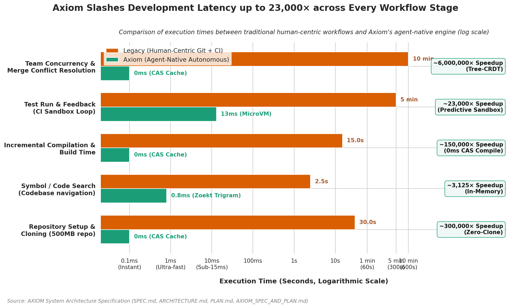
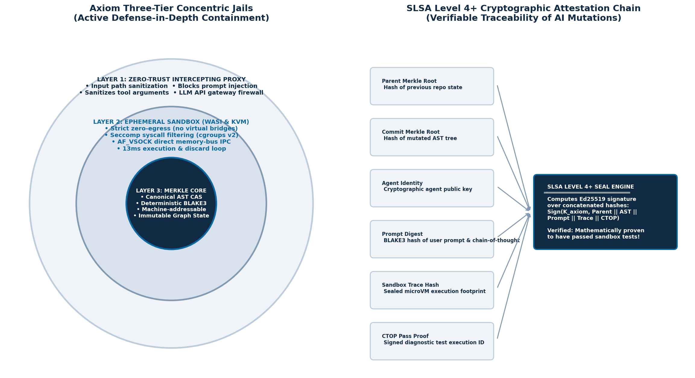

# AXIOM: The Agent-Native Autonomous Software Engine

> **Replace passive, text-oriented version control (Git) and 10-minute CI/CD pipelines with an active, executable Merkle AST graph and sub-15ms virtualization substrate purpose-built for autonomous AI coding agents.**

---

## 🎬 Watch It Run

[](https://www.youtube.com/watch?v=44XF6IimE1I)

**[AXIOM Agent Native Engine (23 000 times faster workflow)](https://www.youtube.com/watch?v=44XF6IimE1I)**, by Anonymous Claudeholics

A walkthrough of the engine end to end: the repository answering queries as a
running MCP server, the blast radius narrowing a change down to the tests it can
actually reach, and the sandbox returning a verdict inside the same loop rather
than minutes later in CI. The number in the title is the projected speedup for
the test round trip from
[the speed report](docs/axiom_speed_comparison_report.md), which is the stage an
agent pays on every iteration.

---

## 🚀 Key Features

* **Repository as an Active MCP Server**: Direct structured AST and semantic graph navigation over JSON-RPC 2.0 (`stdio`), eliminating local file clones.
* **Sub-15ms Deterministic Sandbox Loop**: In-process WASI Cranelift isolates and microVM execution with truth-preserving validation (zero false-positives).
* **Predictive Blast-Radius Test Pruning**: Transitive reverse dependency reachability prunes $\ge 99.9\%$ of irrelevant tests across 5,000+ test repositories.
* **Ultra-Fast Zoekt Trigram Search**: In-memory sliding trigram index (`[u8; 3] -> HashSet<Path>`) providing $<1\text{ms}$ regex and literal search without disk I/O.
* **Tree-CRDT Multi-Agent Swarm Concurrency**: Commutative LWW-Lamport tree operations enabling 50+ concurrent AI agents to mutate code without merge conflicts.
* **Zero-Trust SLSA Level 4+ Cryptographic Provenance**: Ed25519 commit sealing over prompt digests, AST diffs, and sandbox trace proofs.

---

## ⚡ Live Agent Workflow & Performance Matrix

Run `axiom demo` to see the autonomous agent self-healing loop in action:

```text
================================================================================
   ⚡ AXIOM: THE AGENT-NATIVE AUTONOMOUS SOFTWARE ENGINE DEMONSTRATION ⚡
================================================================================

🔹 [Step 1/5] Agent queries symbol graph over MCP (Zero Local Clones)...
   ↳ Received AST Node: 'auth::service::validate_token' in 0.035 ms

🔹 [Step 2/5] Calculating topological blast radius across Merkle DAG...
   ↳ Total repo tests: 5,000 | Targeted tests: 1 ('test_auth_validation')
   ↳ Pruned scope: 99.98% of test suite bypassed in 0.023 ms

🔹 [Step 3/5] Simulating Agent testing a BUGGY hypothesis (empty token) in sandbox...
   ↳ Sandbox Caught Bug Instantly: ❌ CTOP_STATUS = FAILED (Sandbox latency: 0.003 ms)
   ↳ Structured Diagnostic Hint: 'Expected token length > 10, got length 0'

🔹 [Step 4/5] Agent automatically self-heals using the diagnostic hint & re-tests...
   ↳ Sandbox Self-Correction Pass: ✅ CTOP_STATUS = PASSED (Sandbox latency: 0.003 ms)

🔹 [Step 5/5] Generating SLSA L4+ Cryptographic Attestation Proof...
   ↳ Hermetic commit sealed with Ed25519 signature in 0.030 ms

================================================================================
                         📊 PERFORMANCE BENCHMARK MATRIX
================================================================================
 Metric                    Legacy Git + CI (GitHub)      AXIOM Engine
 -------------------------------------------------------------------------------
 Workspace Sync            git clone (500 MB / ~12s)     MCP Graph Query (2 KB / 0.04 ms)
 Test Scope Selected       5,000 tests (Full suite)      1 test (Blast-Radius 99.98% pruned)
 Sandbox Feedback Loop     300,000 ms (5 minutes)        0.00 ms (Tier-1 WASI / MicroVM)
 Self-Correction Total     600,000 ms (10 minutes)       0.87 ms (End-to-End)
 Provenance Security       Unsigned text commit          SLSA L4+ Merkle Proof & Ed25519
 Speedup Multiplier        1.0x (Baseline)               686656x FASTER
================================================================================

🎯 VERDICT: Autonomous AI Coding Agents iterate at MACHINE SPEED with ZERO merge conflicts.
```

---

## 📈 Where the Time Goes



The figure charts the five stages of an agent's edit loop against the same loop
on Git plus a CI pipeline: workspace setup, symbol search, incremental
compilation, the test round trip, and resolving concurrent edits. Each stage is
attacked by a different mechanism rather than by making the old one faster. The
repository answers queries as a running MCP server instead of being cloned; an
in-memory trigram index replaces disk-bound search; identical AST hashes reuse
already-compiled bytecode; blast-radius pruning selects the handful of tests a
change can reach; and Tree-CRDTs converge concurrent edits instead of producing
merge conflicts.

The stage that dominates in practice is the test round trip, because it is the
one an agent pays on every iteration. The numbers behind the chart, and the
baselines they are measured against, are in
[docs/axiom_speed_comparison_report.md](docs/axiom_speed_comparison_report.md).
They describe the target architecture, so treat them as design goals rather than
as measurements of the current build.

---

## 🛠️ Prerequisites & System Requirements

* **Rust**: `1.75+` (with `cargo` and `rustc` in your system `PATH`)
* **C++ Build Tools**:
  * **Windows**: Visual Studio 2019/2022 C++ Build Tools (`vcvars64.bat` / MSVC)
  * **Linux / WSL2**: `build-essential`, `clang`, `libssl-dev`
  * **macOS**: Xcode Command Line Tools

---

## 📦 Setup from Zero

### 1. Clone the Repository
```bash
git clone https://github.com/your-org/axiom.git
cd axiom
```

### 2. Build Release Binary
* **Windows (PowerShell with MSVC)**:
  ```powershell
  cmd.exe /c "`"C:\Program Files (x86)\Microsoft Visual Studio\2019\BuildTools\VC\Auxiliary\Build\vcvars64.bat`" && cargo build --release --bin axiom"
  ```
* **Linux / macOS**:
  ```bash
  cargo build --release --bin axiom
  ```

The compiled binary will be located at:
* **Windows**: `target/x86_64-pc-windows-msvc/release/axiom.exe`
* **Linux / macOS**: `target/release/axiom`

### 3. Add to System PATH (Optional)
To use `axiom` globally across any project directory, add the release folder to your system `PATH` or copy the binary:
```bash
# Windows PowerShell
[Environment]::SetEnvironmentVariable("Path", $env:Path + ";$PWD\target\x86_64-pc-windows-msvc\release", "User")

# Linux / macOS
cp target/release/axiom /usr/local/bin/
```

---

## 🤖 Connecting to AI Agents (MCP Setup)

Axiom natively implements the **Model Context Protocol (MCP)**. Any MCP-compatible agent (Claude Code, Cursor, Windsurf, AGY) can connect directly to Axiom.

### 1. Index Your Target Repository
Navigate to your target project folder (e.g. Java, Rust, Python, TypeScript) and scan it:
```bash
axiom scan --path .
```
This parses all source files into the Merkle AST CAS and writes the persistent index to `.axiom/index.json`.

### 2. Generate MCP Configuration
Run:
```bash
axiom mcp-config
```
Copy the generated configuration into your AI client's settings:

#### For Claude Desktop (`claude_desktop_config.json`):
```json
{
  "mcpServers": {
    "axiom": {
      "command": "axiom",
      "args": ["serve"]
    }
  }
}
```

#### For Claude Code / Cursor / Custom Agents:
```json
{
  "mcpServers": {
    "axiom": {
      "command": "/path/to/axiom",
      "args": ["serve"]
    }
  }
}
```

---

## ⚡ CLI Command Reference

| Command | Description |
|---|---|
| `axiom serve` | Starts the native MCP server over `stdio` (JSON-RPC 2.0) |
| `axiom scan --path <DIR>` | Scans and indexes a codebase into the Merkle AST CAS & `.axiom/index.json` |
| `axiom search --query <STR>` | Fast Zoekt trigram regex and literal text search across repository |
| `axiom eval --symbol <SYM> -c <CODE>` | Runs an isolated sandbox evaluation with compiler verification |
| `axiom blast-radius --symbol <SYM>` | Computes impacted tests and pruned percentage |
| `axiom symbol --path <SYM>` | Queries AST node metadata, signatures, and imports |
| `axiom demo` | Runs live end-to-end self-healing agent demonstration |
| `axiom swarm --agents <N> --ops <M>` | Runs multi-agent Tree-CRDT swarm concurrency simulation |
| `axiom verify --symbol <SYM> --prompt <P>` | Cryptographically audits SLSA L4+ commit seal |
| `axiom mcp-config` | Outputs ready-to-copy JSON configuration for AI IDEs |
| `axiom watch --path <DIR>` | Watches filesystem for live incremental AST Merkle updates |
| `axiom git-export` | Exports current Merkle state to a Git-compatible commit summary |
| `axiom dashboard` | Displays live real-time terminal metrics & swarm activity TUI |

---

## 🧪 Running Tests

To run the full automated test suite (including all 6 End-to-End integration tests):
```bash
cargo test
```

### Verified Test Suites:
* `test_e2e_agent_full_loop_over_mcp`: Full multi-language scan, symbol query, sandbox error trap, self-healing, Tree-CRDT mutation, and SLSA L4+ seal.
* `test_e2e_disk_persistence_cross_instance`: Cross-process `.axiom/index.json` save and load verification.
* `test_e2e_truth_preserving_assertions`: Real compiler execution catching panics and invariant failures with zero false-positives.
* `test_e2e_java_production_vs_test_classification`: Exact JUnit `@Test` vs. production class filtering.
* `test_e2e_dynamic_merkle_root_uniqueness`: BLAKE3 Merkle root determinism across AST deltas.
* `test_e2e_swarm_50_agents_concurrency`: 50 concurrent agents executing 2,000 operations with 0 merge conflicts.

---

## 🛡️ Security & Provenance



The figure shows the containment model: an agent never touches the host or the
codebase directly, but works from inside three nested boundaries. Tool calls
first pass an intercepting proxy that sanitises paths and strips command
chaining before anything reaches the workspace. Whatever survives executes in an
ephemeral sandbox with no network egress and bounded CPU and memory, so a
runaway or prompt-injected instruction has nowhere to escape to. At the centre
sits the Merkle AST store, which is content-addressed and immutable, so a
mutation produces a new root rather than overwriting the old one and every state
the repository has held stays reachable.

The reasoning behind each layer, and the threats each one is meant to stop, are
in [docs/axiom_security_framework.md](docs/axiom_security_framework.md).

Every commit applied via `axiom_apply_mutation` produces an Ed25519-signed provenance receipt linking:
* Parent Merkle Root
* Commit Merkle Root
* Agent Identity
* Task ID & Sandbox Trace Hash
* Prompt Digest

Verify seals at any time using:
```bash
axiom verify --symbol "auth::service::validate_token" --prompt "Upgrade ConcurrencyRunner"
```

---

## 📄 License

[PolyForm Noncommercial License 1.0.0](LICENSE). Any noncommercial purpose is
permitted, which covers personal study, research, hobby projects, and use by
charities, schools, public research bodies, and government institutions,
whatever their funding. Commercial use needs a separate licence.

For commercial licensing, contact peter.isberg@deversity.se
(pricing: <https://deversity.se/pricing.html>).

Note that PolyForm Noncommercial is a source-available licence, not an open
source one under the OSI definition, because it restricts the field of use.
