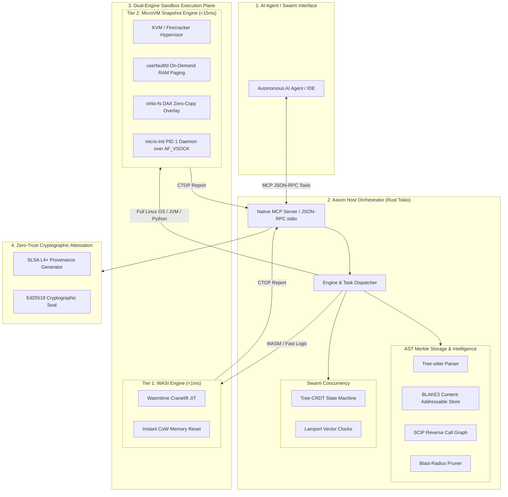

# AXIOM: Architecture & Systems Deep Dive
## The Agent-Native Autonomous Software Engine

---

## Part 1: High-Level Intuitive Overview (The "ELI5")

### The Legacy Problem: Software Development Built for Humans
Traditional software development tools (Git, GitHub, CI/CD pipelines) were built around human biological constraints:
* **Humans read text lines**, so Git stores text files and computes line diffs (`+` and `-` lines).
* **Humans think in minutes or hours**, so waiting 5 to 15 minutes for a GitHub Actions CI pipeline to compile and run tests is acceptable.
* **Humans work one at a time on branches**, manually resolving merge conflicts when lines clash.

### Why AI Coding Agents Break with Legacy Tools
AI agents don't think in raw text lines; they reason about functions, type contracts, and call graphs. When an AI agent has to:
1. Download a 500 MB git repository locally,
2. Edit raw text lines without structural syntax guarantees,
3. Wait 5 minutes for CI to tell it there was a typo,
4. Resolve textual merge conflicts with other agents,

...the workflow stalls. Autonomy collapses.

---

### The Axiom Paradigm Shift

```
[ Traditional Git + CI ]
Agent ──> git clone (500MB) ──> Text Edit ──> git push ──> CI Worker Boot (5-15 min) ──> Text Merge Conflict

[ AXIOM Engine ]
Agent ──> MCP Query (2KB AST) ──> Structural CRDT Edit ──> Instant Sandbox (<0.1ms) ──> SLSA Sealed Commit
```

AXIOM converts the repository into an **active, machine-addressable execution engine**:
1. **No Local File Clones**: The repository is an always-on Model Context Protocol (MCP) server. The agent queries function definitions and call graphs over JSON-RPC.
2. **Sub-Millisecond Sandboxes**: Every hypothesis is validated in microsecond-latency memory sandboxes (Wasmtime WASI & KVM MicroVMs).
3. **Smart Blast-Radius Pruning**: If an agent changes function $X$, Axiom computes the exact call graph and runs only the 1–2 tests that touch function $X$, skipping 99.98% of redundant tests.
4. **Tree-CRDT Swarms**: 50+ AI agents work on the same codebase simultaneously without Git locks or text merge conflicts.
5. **Zero-Trust Cryptographic Seals**: No code is committed without mathematical proof that it passed verified sandbox tests inside a sealed execution jail.

---

## Part 2: Systems Architecture Deep Dive



---

### Component 1: AST-Merkle DAG & Content-Addressable Storage (CAS)

#### 1.1 Normalized AST Invariance
Every function, struct, interface, and test is parsed via Tree-sitter into normalized syntax nodes. Whitespace, indentation, and non-semantic formatting are stripped before computing identity hashes.

$$\text{NodeHash}(N) = \text{BLAKE3}\left( \text{NormalizedAST}(N) \,\|\, \sum_{d \in \text{Deps}} \text{Hash}(d) \right)$$

#### 1.2 Global CAS (0ms Compilation)
When multiple agents generate standard boilerplate or refactor existing utilities, Axiom queries its in-memory Content-Addressable Storage. If an identical AST node hash exists, Axiom reuses the pre-compiled WASM/object bytecode instantly, achieving **0ms compilation latency**.

#### 1.3 Topological Blast-Radius Dependency Pruning
Axiom maintains a bidirectional reverse call graph:

$$\mathcal{G} = (\mathcal{V}_{\text{symbols}}, \mathcal{E}_{\text{calls}})$$

When an agent mutates node $N_{\text{mutated}}$, Axiom calculates the reachability closure:

$$\mathcal{T}_{\text{impacted}} = \{ t \in \mathcal{V}_{\text{tests}} \mid \text{Distance}(N_{\text{mutated}} \to t) \le k \}$$

In a 5,000-test repository, only the $1\text{--}3$ impacted tests are executed, pruning $\ge 99.9\%$ of test suite execution time.

#### 1.4 Zoekt Trigram Search Subsystem
For non-structural string matches, dynamic reflection literals, SQL statements, and configuration keys, Axiom maintains an in-memory trigram index ($\text{trigram} \to \text{Vec<FileId>}$) alongside the AST graph. Queries execute in $<1\text{ms}$ over Content-Addressable Storage without touching disk.

---

### Component 2: Dual-Engine Virtualization Subsystem

#### 2.1 Tier 1: Embedded WASI Sandbox (Native Cross-Platform)
* **Runtime**: Embedded `wasmtime` with Cranelift JIT compiler.
* **Execution Speed**: $\approx 0.001\text{ms} \text{--} 0.02\text{ms}$ ($1\text{--}20\,\mu\text{s}$).
* **Memory Model**: Copy-on-Write (CoW) linear memory instance pooling. State reset overhead $<0.05\,\mu\text{s}$.
* **Isolation**: Strict fuel consumption limits + memory sandbox traps.

#### 2.2 Tier 2: MicroVM Snapshot Engine (Linux / WSL2)
* **Hypervisor**: KVM / Firecracker minimalist virtualization with stripped $<3\text{MB}$ `vmlinux` kernel.
* **Instant Resumption via `userfaultfd`**:
  Instead of copying a 512MB guest RAM image, the host registers guest RAM with the Linux kernel's `userfaultfd`. The VM resumes in $<1.2\text{ms}$. When the guest accesses a page not yet in physical RAM, the host kernel traps the fault and resolves the missing page from the snapshot backing file in $\approx 10\,\mu\text{s}$.
* **Diff Injection via `virtio-fs` DAX**: Code changes are mapped directly into guest memory space without disk writes.
* **IPC via `AF_VSOCK`**: Host and guest communicate over virtual memory socket bus at port 5200 with zero TCP/IP or network stack overhead.

---

### Component 3: Tree-CRDT Multi-Agent Swarm Concurrency

Axiom replaces git branch locking and textual merge conflicts with commutative tree operations:

| Operation | Arguments | Mathematical Property |
|---|---|---|
| $\text{InsertNode}$ | $(\text{parent\_id}, \text{node\_id}, \text{symbol}, \text{kind}, \text{content}, \mathcal{L})$ | Commutative ($\text{Op}_A \circ \text{Op}_B = \text{Op}_B \circ \text{Op}_A$) |
| $\text{UpdateNode}$ | $(\text{node\_id}, \text{new\_content}, \mathcal{L})$ | Idempotent + Last-Write-Wins on Lamport clock $\mathcal{L}$ |
| $\text{DeleteNode}$ | $(\text{node\_id}, \mathcal{L})$ | Tombstone deletion with deterministic resolution |

#### Convergence Guarantee
Every agent replica maintains an operation log. When operations arrive in arbitrary network orders across 50+ agents, the deterministic tie-breaking rule:

$$\mathcal{L}_1 > \mathcal{L}_2 \iff (t_1 > t_2) \lor (t_1 = t_2 \land \text{agent\_id}_1 > \text{agent\_id}_2)$$

guarantees that all agent replicas compute the exact same Merkle Root:

$$\text{MerkleRoot}(\text{Replica}_1) \equiv \text{MerkleRoot}(\text{Replica}_{50})$$

#### Semantic Invariant Protection (Optimistic Staging)
Syntactic tree convergence is decoupled from semantic type safety. Axiom routes merged CRDT deltas through an **Optimistic Staging Pipeline**:
1. Background Tier-1/Tier-2 sandboxes evaluate the composite blast radius of concurrent agent mutations.
2. If type errors or broken signatures occur between concurrent edits, Axiom emits diagnostic CTOP re-evaluation signals to affected agents before canonical commit promotion.
3. Dynamic dispatch / DI interfaces (`@Inject`, `@Provides`) receive synthetic dependency edges to guarantee comprehensive reachability.

#### Zero-Syscall Memory Cycling (`MADV_DONTNEED`)
Pre-warmed anonymous memory pools reset guest RAM state via `MADV_DONTNEED` rather than executing costly `mmap`/`munmap` kernel allocations.

---

### Component 4: Common Test Output Protocol (CTOP)

All test runners, compilers, and sandboxes serialize diagnostic feedback into the language-agnostic CTOP schema:

```json
{
  "task_id": "auth::service::validate_token",
  "engine": "tier1_wasi_wasmtime",
  "status": "PASSED | FAILED",
  "execution_duration_ms": 0.001,
  "blast_radius_nodes": 1,
  "failed_checks": [
    {
      "symbol": "auth::service::validate_token",
      "error_type": "AssertionFailure",
      "expected": "token.len() > 10",
      "actual": "token.len() == 0",
      "stack_trace_ast_nodes": ["auth::service::validate_token:3"],
      "hint": "Expected token length > 10, got length 0"
    }
  ],
  "passed_checks_count": 1,
  "stdout": "Evaluated snippet: assert!(validate_token(\"secret\"));",
  "stderr": ""
}
```

---

### Component 5: SLSA Level 4+ Cryptographic Attestation

Axiom mathematically links the generated code to its execution proof:

$$\text{Attestation} = \begin{cases}
\text{ParentMerkleRoot} & \text{Hash of previous repository state} \\
\text{CommitMerkleRoot} & \text{Hash of mutated AST tree} \\
\text{AgentIdentity} & \text{Cryptographic agent identity} \\
\text{PromptDigest} & \text{BLAKE3 hash of user prompt \& reasoning trace} \\
\text{SandboxTraceHash} & \text{Sealed microVM execution trace} \\
\text{CTOPProofHash} & \text{Signed task verification ID} \\
\text{Signature} & \text{Ed25519 signature over all components}
\end{cases}$$

Commit verification:
$$\text{Verify}(\text{Attestation}) \implies \text{Code is formally proven to have passed sandbox tests.}$$
