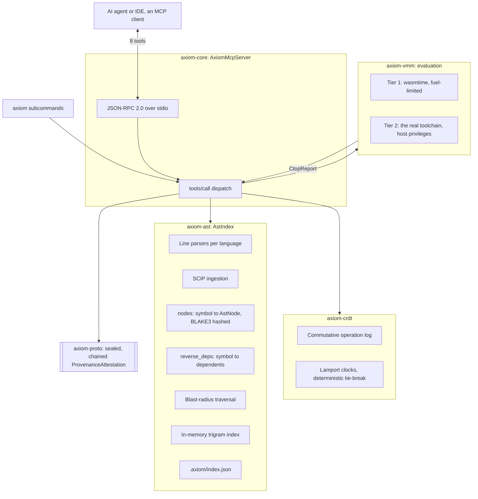

# AXIOM: Architecture

This document describes the system as it is built. Where an earlier version
described a component that does not exist, it now says so in
[Part 3](#part-3-designed-and-not-built) rather than in the present tense.

Re-derive anything here from the code before relying on it. Line counts and
crate boundaries move.

---

## Part 1: The shape of it

A Rust workspace of six crates producing **one binary**, `axiom`, which is
simultaneously a CLI and an MCP server speaking JSON-RPC 2.0 over stdio. It
indexes a target codebase into an in-memory symbol graph, persists that graph to
`.axiom/index.json`, and answers queries against it.

Dependencies run one way. `axiom-proto` is the leaf; nothing depends on
`axiom-cli`.

```
axiom-proto ──► everything     wire types only: AstNode, CtopReport, ProvenanceAttestation
axiom-ast   ──► core, crdt     the indexer: parsers, symbol graph, blast radius, trigram search, disk I/O
axiom-vmm   ──► core           the evaluator: wasmtime and native toolchain tiers
axiom-crdt  ──► core           Tree-CRDT plus swarm simulation
axiom-core  ──► cli            the MCP server: tool schemas and dispatch
axiom-cli                      clap subcommands, all of which drive AxiomMcpServer
```

**The CLI is not a separate code path.** Every subcommand constructs an
`AxiomMcpServer` and calls the same crates the MCP tools use, so a bug
reproduced through `axiom blast-radius` is the same bug an agent sees through
`axiom_get_blast_radius`. That is why the CLI is worth having as a debugging
surface rather than as a second implementation to keep in step.



---

## Part 2: The components that exist

### 2.1 The symbol index

`crates/axiom-ast/src/lib.rs` is the bulk of the system, around 4,200 lines, and
holds several maps that must stay in agreement: `nodes` (symbol to `AstNode`),
`reverse_deps` (symbol to dependents), `symbol_to_file`, and the
`method_return_types` and `clean_file_texts` maps behind accessor inference.
Anything that inserts into one usually has to update the others.

**Parsing is line-based heuristics, not Tree-sitter.** `parse_file_content`
dispatches on file extension: Java (shared with Kotlin and Scala), Rust, Python,
TypeScript/JavaScript, Go and C++ each have their own line parser that walks
lines and matches on shape. There is no Tree-sitter dependency in the workspace.
That approach has already produced javadoc text hijacking a class name, methods
filed under the wrong nested type, `catch` clauses indexed as methods, and
machine-absolute paths written into symbol names. Each of those is now pinned by
a test, and each is one loosened match away from returning.

Comments and string literals are stripped before a line is examined for a
declaration, because a repository whose subject is parsing writes source inside
string literals constantly. `strip_comments_and_strings` preserves the line
count, which is what makes indexing stripped lines alongside raw ones safe; the
raw line is still what gets stored as the signature.

**A node's hash covers its body, not just its declaration line.** `body_span`
bounds a body by brace balance, or by indentation where the declaration opens no
brace. Hashing the declaration alone meant that editing what a function does
moved nothing, which defeats every hash-derived guarantee downstream.

**Symbol keys are relative to the scan root.** `key_under_root` returns the path
below the scanned root with forward slashes and no absolute prefix, so a Rust
symbol is `crates/axiom-ast/src/lib.rs::AstIndex`, not
`C:/dev/.../lib.rs::AstIndex`. That is what makes an index committable and a
Merkle root comparable across machines. The filesystem still needs the absolute
path, so the scan root is kept separately and re-derived on load from the index's
own location.

$$\text{NodeHash}(N) = \text{BLAKE3}\big(\text{declaration}(N) \,\|\, \text{body}(N)\big)$$

### 2.2 SCIP ingestion, the alternative to the heuristics

`crates/axiom-ast/src/scip_ingest.rs` reads a SCIP index that a language's own
indexer produced (scip-java, `rust-analyzer scip`, and the rest) and builds the
same `AstIndex` from resolved definitions and references. `axiom scan --scip
<file>` routes to `AstIndex::ingest_scip` and persists exactly as a scan does, so
every tool downstream is unchanged.

Edges come from charging each reference occurrence to the definition whose
`enclosing_range` contains it, keeping only references to symbols defined
somewhere in the index. `SymbolInformation.relationships` add edges an occurrence
scan misses, such as an implementation reaching its interface. A test is marked
by the SCIP `Test` role where the indexer sets it; scip-java does,
rust-analyzer does not for `#[test]`, so ingestion falls back to axiom's own
heuristic there, or a SCIP-ingested Rust project would have no tests in its blast
radius at all.

### 2.3 Dependency edges

**Java has three mechanisms and everything else has a fourth.** Java edges come
from imports, from same-package and fully-qualified references, and from accessor
return-type inference, because a test calling `ctx.sharedRaceConditionDetector()`
never names the type. Precision trades against recall in both directions:
widening re-admits comment noise, narrowing drops real dependents.

Rust, Python, TypeScript, JavaScript and Go go through `record_references` and
`resolve_reference_edges`. References are collected per line while parsing, then,
once the whole tree has been read, each is charged to the last symbol declared
above it and kept only if some indexed symbol answers to that name. The pass runs
at the end of `scan_directory` rather than per file, because a file that
references a symbol defined further down the walk cannot be resolved when it is
read.

Before that pass existed, these languages recorded each file's `use` and `import`
lines verbatim as every node's dependencies, so `reverse_deps` was keyed by
strings like `anyhow::Result` and nothing resolved to an indexed symbol.

### 2.4 Blast-radius selection

Axiom keeps a reverse call graph and walks it from the mutated symbol outward:

$$\mathcal{T}_{\text{impacted}} = \{\, t \in \mathcal{V}_{\text{tests}} \mid \text{dist}(N_{\text{mutated}} \to t) \le k \,\}$$

`reverse_deps` is keyed by the name a caller writes and its values are full
symbol paths, so the traversal has to look up both on each hop. Depths beyond `k`
are surveyed and reported separately, so a caller can widen deliberately rather
than be silently over- or under-served.

**What it prunes is measured, not asserted.** Run
`.github/scripts/blast_radius_stats.py` against a scanned tree; the README quotes
its output for two trees. The short version: on a 3,429-test Java suite a symbol
selects a median of 8 tests, and on this 53-test repository it selects a median
of 4. The saving scales with the suite, and no fixed percentage holds across
repositories.

**Ground truth comes from `axiom cache-validate`, not from the graph's opinion of
itself.** It breaks a symbol on purpose, runs the project's real suite, and
checks that every test that actually failed was selected. Its first run here
found a real hole. `axiom cache-audit` compares two readings of the same graph,
so a call the parsers never recorded is invisible to both walks at once; see
[verdict_cache_audit.md](verdict_cache_audit.md).

### 2.5 Trigram search

An in-memory sliding trigram index, `[u8; 3] -> HashSet<Path>`, built at server
startup alongside the AST graph, answering literal and regex queries without
touching disk. Warm, a query returns in about 0.3 ms on a 9,058-symbol tree. It
is faster than `grep` only once warm: the scan and the startup that get it there
cost four to six seconds, which takes roughly 50 queries to repay. Figures in
[axiom_speed_comparison_report.md](axiom_speed_comparison_report.md).

### 2.6 Evaluation, in two tiers

**Tier 1** is `wasmtime` with Cranelift, a fuel limit, and no WASI host functions
bound. A `.wat` or `.wasm` snippet runs there and can reach nothing outside its
own linear memory.

**Tier 2** is the real compiler or interpreter for the symbol's language: `rustc`
for Rust, and the language's own toolchain for Python, JavaScript, TypeScript,
Go, Java, Kotlin and Scala. It is **not a sandbox**. Each runs as an ordinary
child process with the axiom process's own privileges.
[axiom_security_framework.md](axiom_security_framework.md) is the document that
states what is and is not contained; the short version is an environment
allowlist and a wall-clock deadline that kills the process tree, and nothing
else.

The language is resolved through the symbol, not through the caller's spelling of
it, because comparing a short name against stored keys returned `None` for every
short name and `None` meant Rust. An ambiguous name is refused with
`AmbiguousSymbol` and its candidates rather than compiled as whichever language
won.

`LANGUAGES` in `axiom-vmm` and `parse_by_language` in `axiom-ast` are twins that
live in different crates: one decides what is indexed, the other what can be run.
`every_indexed_language_has_an_evaluator` fails when they diverge, because Kotlin
and Scala sat on the first list and not the second for as long as the tier
existed.

### 2.7 Tree-CRDT concurrency

| Operation | Arguments | Property |
|---|---|---|
| `InsertNode` | parent id, node id, symbol, kind, content, clock | Commutative |
| `UpdateNode` | node id, new content, clock | Idempotent, last-write-wins on the clock |
| `DeleteNode` | node id, clock | Tombstone, deterministic resolution |

Ties break deterministically:

$$\mathcal{L}_1 > \mathcal{L}_2 \iff (t_1 > t_2) \lor (t_1 = t_2 \land \text{agent\_id}_1 > \text{agent\_id}_2)$$

so replicas that received operations in different orders compute the same Merkle
root. Measured with twelve agents mutating one workspace at once: twelve
operations recorded, none lost or duplicated, one identical root across four
replay orders. `axiom swarm --agents 10 --ops 50` runs 1,000 operations in about
9.5 ms with zero conflicts.

**The root that `axiom scan` prints comes from the CRDT tree, not the AST index.**
Keep the two apart when reading output.

### 2.8 CTOP, the evaluation report

Every tier serialises its outcome into one schema. `status` is one of `PASSED`,
`FAILED`, `TIMEOUT`, `COMPILATION_ERROR` or `EVALUATOR_UNAVAILABLE`. That last
one is the load-bearing variant: it says nothing was run, so nothing is known,
and it is deliberately distinct from `COMPILATION_ERROR`, which says the code was
read and rejected. Collapsing them tells an agent its snippet is wrong when the
truth is that nobody looked at it.

```json
{
  "task_id": "auth::service::validate_token",
  "engine": "tier1_wasi_wasmtime",
  "status": "PASSED",
  "execution_duration_ms": 0.001,
  "blast_radius_nodes": 1,
  "failed_checks": [],
  "passed_checks_count": 1,
  "passed_checks_basis": "assertion tokens found in the snippet text; not assertions observed to execute",
  "stdout": "Evaluated snippet: assert!(validate_token(\"secret\"));",
  "stderr": "",
  "memory_allocated_bytes": null
}
```

`passed_checks_basis` travels with the count on purpose. For the native tiers the
count is the number of assertion tokens in the snippet's text, because no
toolchain reports how many assertions ran, and a snippet with the word `assert`
in a comment counts it. A count that does not say what it counts reads as a
measurement.

### 2.9 The provenance record

`seal_over` in `axiom-proto` hashes ten length-prefixed fields: both Merkle
roots, the agent identity, the symbol path, the CTOP proof hash, `verified_by`,
`verification_detail`, the timestamp, the previous record's seal, and the prompt.
Signing with Ed25519 is optional and adds a claim about *who*, which the seal
alone cannot make.

$$\text{Verify}(A) \implies \text{this record has not been altered since it was written}$$

That is the whole implication, and it is smaller than the one this document used
to state. Verification does not establish that the code is correct, that a build
was hermetic, or that the check the record names was adequate. It is not SLSA at
any level. [axiom_security_framework.md](axiom_security_framework.md) sets out
what a record does and does not carry.

### 2.10 Persistence and discovery

`save_to_disk` returns the path it wrote and verifies the file exists, and
callers propagate the error. When these were discarded under an unconditional
success banner, `scan` printed "Saved to .axiom/index.json" while writing nothing
and the server then served an empty index.
`test_e2e_disk_persistence_cross_instance` writes in one instance and reads in
another, which is the only shape that catches it.

`find_index_file` climbs parent directories looking for `.axiom/index.json`, and
the server records the directory it found so that every write lands where the
read came from. `axiom scan` and `axiom watch` are the deliberate exception: they
anchor to the local `.axiom/index.json` and nothing above it, because a scan
states what one tree contains and must not fold an ancestor index into it.

---

## Part 3: Designed, and not built

Everything in this section appeared in earlier versions of this document in the
present tense, with latencies attached. None of it exists. The latencies were
never measured against anything.

| Described | Reality |
|---|---|
| Tree-sitter parsing into normalised syntax nodes | Line-based heuristics per language. No Tree-sitter dependency. SCIP ingestion is the precise path instead. |
| Tier 2 MicroVM snapshot engine: KVM/Firecracker, `<3MB vmlinux`, `userfaultfd` paging, `virtio-fs` DAX, `micro-init` over `AF_VSOCK` port 5200 | Not built. Those languages run as ordinary child processes on the host. |
| Zero-syscall memory cycling via `MADV_DONTNEED` | Not built. There is no guest RAM to cycle. |
| `<0.1ms` and `<15ms` sandbox latencies | A snippet is compiled and run. Rust median 271 ms on the development machine, `rustc` dominating. Measure with `axiom bench`. |
| Global CAS reuse of pre-compiled bytecode for `0ms` compilation | Not built. The content-addressed store has the functions for it and nothing calls them; running the same snippet twice compiles it twice. |
| `99.9%` of tests pruned, `1-3` tests in a 5,000-test repository | Depends entirely on the symbol and the suite. Measured medians: 8 of 3,429 on a Java tree, 4 of 53 here. Some symbols reach no test at all. |
| Optimistic staging pipeline re-evaluating merged CRDT deltas | Not built. The CRDT converges; nothing type-checks the merged result. |
| Synthetic dependency edges for `@Inject` and `@Provides` | Not built. |
| SLSA Level 4+ attestation | A provenance record tying a prompt, a symbol and a check together. Not SLSA at any level. |
| Zero-trust intercepting proxy | Not built. See [axiom_security_framework.md](axiom_security_framework.md). |

The design is not disowned by listing it here. It says where the system is
intended to go. It is separated from Part 2 so that nobody reads an intention as
a protection or as a benchmark.
