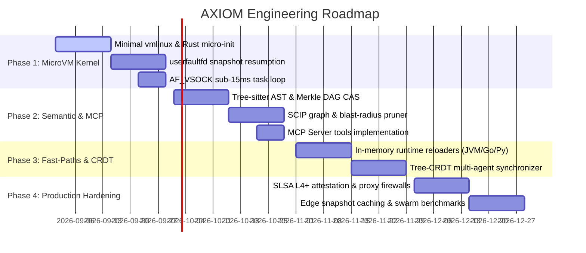

# AXIOM: Agent-Native Autonomous Software Engine

> **This is a specification and a roadmap, not a description of the build.** It
> describes what Axiom is designed to be, including components that do not exist,
> and it opens by saying axiom replaces Git and CI, which it does not: axiom sits
> beside them. For what is built, read [ARCHITECTURE.md](ARCHITECTURE.md), Part 2
> for what exists and Part 3 for what does not.
>
> One term below is wrong rather than merely unbuilt: **SLSA Level 4+**. SLSA is a
> standard about build provenance and hermeticity. What is specified here, and
> what is built, signs a prompt digest and a verification trace, which would not
> be SLSA at any level even if every unbuilt part shipped. Do not carry the term
> forward.

## System Architecture Specification & Engineering Roadmap

---

### 1. Vision & Fundamental Shift

AXIOM replaces passive, text-oriented version control (Git) and sluggish CI/CD pipelines with an active, executable engine purpose-built for autonomous AI coding agents:

| Feature | Legacy Git + CI (Human-Centric) | AXIOM (Agent-Native) |
|---|---|---|
| **Representation** | Raw text lines & files | Content-addressed AST-Merkle DAG |
| **Interface** | Local clones & bash commands | Native Model Context Protocol (MCP) |
| **Feedback Loop** | 2–15 minute async CI runs | Sub-15ms synchronous microVM sandbox |
| **Concurrency** | Textual branches & manual merge conflicts | Commutative Tree-CRDTs for swarms |
| **Build & Test** | Full recompile & broad test sweeps | AST CAS (0ms) + Blast-radius pruning ($\ge 95\%$ pruned) |
| **Provenance** | Loose commit messages / human review | Hermetic cryptographic attestation (SLSA L4+) |

---

### 2. Architecture Overview

```
                                    +-----------------------------+
                                    |     AI Coding Agents        |
                                    | (Cursor, Claude Code, Swarm)|
                                    +--------------+--------------+
                                                   |
                                                   | (MCP / JSON-RPC)
                                                   v
+---------------------------------------------------------------------------------------------------+
| AXIOM HOST ORCHESTRATOR (Rust + Tokio)                                                            |
|                                                                                                   |
|  +-------------------------------------+       +-----------------------------------------------+  |
|  | Native MCP Server                   |       | AST Semantic Engine                           |  |
|  | - axiom_query_symbol                | <---> | - Tree-sitter AST Parser (100+ grammars)      |  |
|  | - axiom_find_references             |       | - SCIP / LSIF Call & Type Graph               |  |
|  | - axiom_eval_patch                  |       | - Merkle DAG Content-Addressable Store (CAS)  |  |
|  | - axiom_apply_mutation (CRDT)       |       | - Blast-Radius Test Pruner (Depth-k closure)  |  |
|  +-------------------------------------+       +-----------------------------------------------+  |
|                     |                                                  |                          |
|                     v                                                  v                          |
|  +---------------------------------------------------------------------------------------------+  |
|  | MicroVM Manager (KVM / Firecracker Snapshot Core)                                           |  |
|  | - Pre-warmed VM Snapshot Pool (Host RAM)                                                    |  |
|  | - userfaultfd On-Demand Page Fault Resolver (~10µs/page)                                    |  |
|  | - virtio-fs DAX Zero-Copy Workspace Overlay Injector                                        |  |
|  | - Zero-Trust Syscall Sandbox (seccomp-bpf, cgroups v2, no network egress)                     |  |
|  +---------------------------------------------------------------------------------------------+  |
+---------------------------------------------------|-----------------------------------------------+
                                                    |
                                                    | (AF_VSOCK / <0.5ms IPC)
                                                    v
+---------------------------------------------------------------------------------------------------+
| EPHEMERAL GUEST MICROVM (<3MB Minimal Linux Kernel / Base RAM Snapshot)                           |
|                                                                                                   |
|  +---------------------------------------------------------------------------------------------+  |
|  | micro-init (PID 1 Rust Daemon)                                                              |  |
|  |                                                                                             |  |
|  |  +---------------------------------------------------------------------------------------+  |  |
|  |  | In-Process Fast-Path Runtime Workers                                                   |  |  |
|  |  | - Python / Node.js: In-memory AST/bytecode reloaders                                  |  |  |
|  |  | - JVM: JVMTI / dynamic ClassLoader bytecode hot-swapping                               |  |  |
|  |  | - Rust / Go: In-memory dynamic linkage & test runner hooks                            |  |  |
|  |  | - WASI: Millisecond Wasmtime execution isolates                                       |  |  |
|  |  +---------------------------------------------------------------------------------------+  |  |
|  +---------------------------------------------------------------------------------------------+  |
+---------------------------------------------------------------------------------------------------+
```

---

### 3. Detailed Component Specifications

#### 3.1 AST-Merkle DAG & Global Content-Addressable Storage (CAS)
* **AST Hashing**: Every code entity (function, struct, method, test) is stored as a canonical AST node hashed via BLAKE3:
  $$\text{Hash}(N) = \text{BLAKE3}\left( \text{NormalizedAST}(N) \,\|\, \sum \text{TypeDepHashes} \right)$$
* **Global CAS**: Identical function bodies or standard boilerplate generated across agents match existing compiled artifacts in memory, executing with **0ms compilation latency**.
* **Blast-Radius Pruning**:
  When node $N$ changes, Axiom computes the reverse transitive closure over the SCIP call graph:
  $$\mathcal{T}_{\text{impacted}} = \{ t \in \text{Tests} \mid \text{PathExists}(N \to t) \}$$
  Only tests in $\mathcal{T}_{\text{impacted}}$ are scheduled, reducing test execution volume by $>95\%$.

#### 3.2 Sub-15ms MicroVM Execution Pipeline
* **Snapshots**: Hypervisor preserves pre-initialized VM states (kernel + runtime + dependencies).
* **`userfaultfd` Lazy Paging**: Guest boots in $<1.5\text{ms}$ with zero initial RAM memcpy. Missing pages are resolved on-demand from read-only snapshot backing files in $\approx 10\,\mu\text{s}$.
* **Zero-Copy Diff Injection**: Code modifications are memory-mapped via `virtio-fs` with DAX directly into guest RAM.
* **Latency Budget**:
  * Snapshot resume & register restore: $1.2\text{ms}$
  * Workspace memory mapping: $0.8\text{ms}$
  * AF_VSOCK IPC dispatch: $0.3\text{ms}$
  * Fast-path test execution: $6.0\text{--}9.0\text{ms}$
  * Structured JSON report emit & teardown: $0.7\text{ms}$
  * **Total round-trip: $<13.0\text{ms}$**.

#### 3.3 Tree-CRDT Multi-Agent Swarm Concurrency
* Replaces line-based diffs with commutative AST tree operations ($\text{InsertChild}$, $\text{ReplaceNode}$, $\text{DeleteNode}$).
* Agents in a swarm modify decoupled functions/classes in parallel without text merge conflicts.
* Speculative execution: Background microVMs validate structural AST invariants and type checks on every incoming CRDT delta.

#### 3.4 Common Test Output Protocol (CTOP)
Language-agnostic JSON feedback format:
```json
{
  "task_id": "axiom_task_98231",
  "status": "FAILED",
  "execution_duration_ms": 11.2,
  "failed_checks": [
    {
      "symbol": "billing.calculator.calculateTax",
      "error_type": "AssertionError",
      "expected": "105.00",
      "actual": "100.00",
      "stack_trace_ast_nodes": ["billing.calculator:45"],
      "hint": "Check state tax exemption rule"
    }
  ],
  "passed_checks_count": 18
}
```

#### 3.5 Zero-Trust Attestation Chain
* Every accepted commit is bundled with a cryptographic SLSA Level 4+ attestation seal:
  $$\text{Seal} = \text{Sign}_{K_{\text{axiom}}}\Big(\text{ParentRoot} \,\|\, \text{ASTDelta} \,\|\, \text{PromptDigest} \,\|\, \text{MicroVMTraceHash} \,\|\, \text{CTOPPassProof}\Big)$$

---

### 4. Phased Engineering Roadmap



| Phase | Milestone Name | Key Deliverables | Success Metric |
|---|---|---|---|
| **Phase 1** (W1–4) | **MicroVM Sandbox Core** | Stripped Linux kernel ($<3\text{MB}$), `micro-init` (PID 1 in Rust), `userfaultfd` memory-paging manager, `AF_VSOCK` dispatcher. | Python/WASI single-test cycle $<15\text{ms}$. |
| **Phase 2** (W5–8) | **AST Engine & MCP Server** | Tree-sitter AST parser, SCIP symbol graph, Merkle CAS, blast-radius calculator, and native MCP tools. | Agent connects via MCP, reads symbols, submits AST patch, verifies in microVM with no local clone. |
| **Phase 3** (W9–12) | **Compiled Runtimes & Tree-CRDT** | JVM ClassLoader bytecode hot-swapper, Go/Rust in-memory linker, Tree-CRDT multi-agent synchronization. | Sub-25ms compiled test loop; 20+ concurrent agents editing without merge conflicts. |
| **Phase 4** (W13–16) | **Zero-Trust Hardening & Scale** | SLSA Level 4+ attestation generator, zero-egress seccomp jails, Anycast edge snapshot cluster distribution. | Zero host escapes; full cryptographic auditability under multi-agent swarms. |

---

### 5. Next Immediate Action Items
1. Initialize Rust workspace (`crates/axiom-core`, `crates/axiom-vmm`, `crates/axiom-ast`, `crates/axiom-guest`).
2. Scaffold `micro-init` minimal guest binary with `tokio-vsock`.
3. Set up KVM snapshot test harness with `userfaultfd` on Linux host / CI environment.
