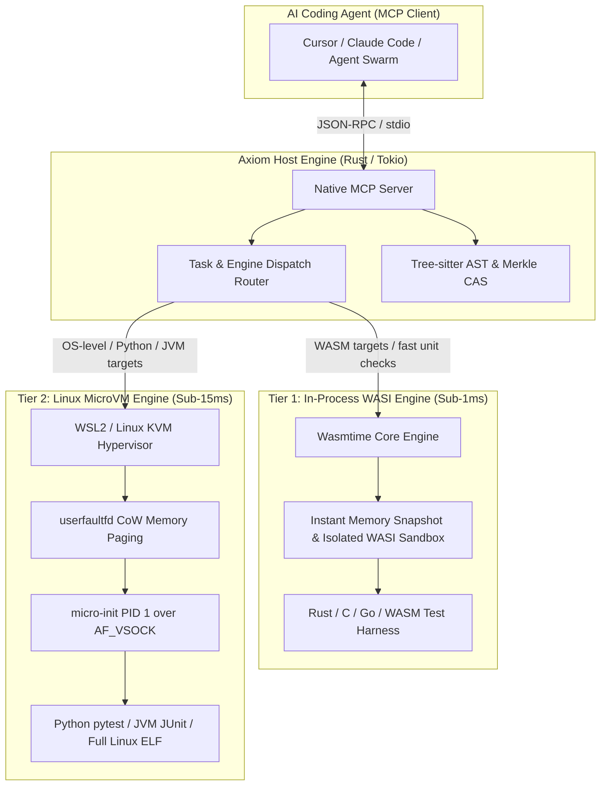

# AXIOM: Agent-Native Autonomous Software Engine

> **This is a specification, not a description of the build.** It describes what
> Axiom is designed to be, including components that do not exist. For what is
> built, read [ARCHITECTURE.md](ARCHITECTURE.md), whose Part 2 covers the
> components that exist and whose Part 3 lists the ones that do not. For what is
> and is not contained at runtime, read
> [axiom_security_framework.md](axiom_security_framework.md).
>
> One term below is wrong rather than merely unbuilt: **SLSA Level 4+**. SLSA is a
> standard about build provenance and hermeticity. What is specified here, and
> what is built, signs a prompt digest and a verification trace, which would not
> be SLSA at any level even if every unbuilt part shipped. Do not carry the term
> forward.

## System Architecture Specification

---

### 1. Architectural Vision

AXIOM transforms repositories from passive text ledgers into active, machine-addressable execution graphs with sub-15ms deterministic verification loops for AI coding agents.

---

### 2. Dual-Engine Virtualization Architecture (Windows & Linux)

To guarantee optimal performance on Windows development workstations alongside edge Linux clusters:



#### 2.1 Tier 1: In-Process Native WASI Engine (<1ms Execution)
* **Technology**: Embedded `wasmtime` runtime with Cranelift JIT.
* **Compatibility**: Native Windows, macOS, and Linux without hypervisors.
* **Memory Management**: Pre-warmed module pooling with copy-on-write memory instances. Reset latency $<0.1\text{ms}$.
* **Primary Workloads**: Rust (compiled to `wasm32-wasip1`), C/C++, Go, AssemblyScript, and lightweight logic validation.

#### 2.2 Tier 2: MicroVM Snapshot Engine (<15ms Execution)
* **Technology**: KVM / Firecracker microVM snapshot orchestration (via WSL2 on Windows with nested virtualization, or native Linux on servers).
* **Memory Management**: `userfaultfd` on-demand paging from base memory dumps.
* **IPC**: `AF_VSOCK` binary framing protocol connecting host to guest `micro-init` (PID 1).
* **Primary Workloads**: Python (pytest), Java (JUnit with JVMTI dynamic class reloading), Node.js, and native Linux binaries.

---

### 3. Core Subsystems

#### 3.1 AST-Merkle DAG & Content-Addressable Storage (CAS)
* **AST Parsing**: Multi-language concrete syntax trees via Tree-sitter.
* **Merkle Content Addressing**:
  $$\text{NodeHash} = \text{BLAKE3}\left( \text{NormalizedAST}(N) \,\|\, \sum \text{TypeDepHashes} \right)$$
* **Global CAS**: Identical function bodies across commits share pre-compiled bytecode / WASM objects $\to$ **0ms compilation**.
* **Blast-Radius Dependency Pruning**:
  Transitive reverse call graph maps mutated AST node $N$ to the exact set of affected tests:
  $$\mathcal{T}_{\text{impacted}} = \{ t \in \text{Tests} \mid \text{Reachable}(N \to t) \}$$
  Reduces executed test count by $\ge 95\%$.

#### 3.2 Tree-CRDT Swarm Synchronization & Optimistic Staging
* Code mutations are represented as commutative tree operations:
  * $\text{InsertChild}(\text{parent\_id}, \text{index}, \text{node\_data})$
  * $\text{ReplaceNode}(\text{node\_id}, \text{new\_ast})$
  * $\text{DeleteNode}(\text{node\_id})$
* **Optimistic Staging Layer**: Resolves semantic brokenness (e.g. signature drift across concurrent agents) by running background composite blast-radius CTOP passes before promoting merged CRDT trees to canonical state.
* **Dynamic Dispatch Synthetic Edges**: Injects synthetic graph edges for DI contracts (`@Inject`, `@Provides`, dynamic reflection) to prevent under-pruning tests.

#### 3.3 Sub-15ms Virtualization & `MADV_DONTNEED` Memory Pooling
* **Zero Alloc Sycall Loops**: Pre-allocates anonymous memory slots cycled with `MADV_DONTNEED` to eliminate `mmap`/`munmap` kernel overhead.
* **userfaultfd Lazy Paging**: Guest boots in $<1.5\text{ms}$ with on-demand page resolution from base snapshot.

#### 3.4 Common Test Output Protocol (CTOP)
Unified JSON feedback format:
```json
{
  "task_id": "axiom_task_01",
  "engine": "tier1_wasi | tier2_microvm",
  "status": "PASSED | FAILED",
  "duration_ms": 4.8,
  "failed_checks": [
    {
      "symbol": "auth.service.validateToken",
      "error_type": "AssertionError",
      "expected": "ValidTokenResponse",
      "actual": "ExpiredToken",
      "stack_trace_ast_nodes": ["auth.service:42"]
    }
  ],
  "passed_checks_count": 12
}
```

#### 3.5 Model Context Protocol (MCP) Tool Matrix
* `axiom_query_symbol(symbol_path)` $\to$ returns AST metadata, signature, docstrings.
* `axiom_get_blast_radius(symbol_path)` $\to$ computes topological test reachability closure.
* `axiom_search_regex(query, max_results)` $\to$ ultra-fast in-memory Zoekt trigram search across repository CAS.
* `axiom_eval_patch(ast_diff, test_targets)` $\to$ executes target tests inside Tier 1 or Tier 2 sandbox in $<15\text{ms}$.
* `axiom_apply_mutation(crdt_ops, commit_msg)` $\to$ merges CRDT AST delta with 0 merge conflicts.
* `axiom_attest_commit(prompt, symbol_path)` $\to$ issues SLSA L4+ cryptographic provenance seal.

#### 3.6 Zero-Trust Attestation Chain (SLSA Level 4+)
* Hermetic commit attestation sealing:
  $$\text{Seal} = \text{Sign}_{K_{\text{axiom}}}\Big(\text{ParentRoot} \,\|\, \text{ASTDelta} \,\|\, \text{PromptDigest} \,\|\, \text{SandboxTrace} \,\|\, \text{CTOPProof}\Big)$$
