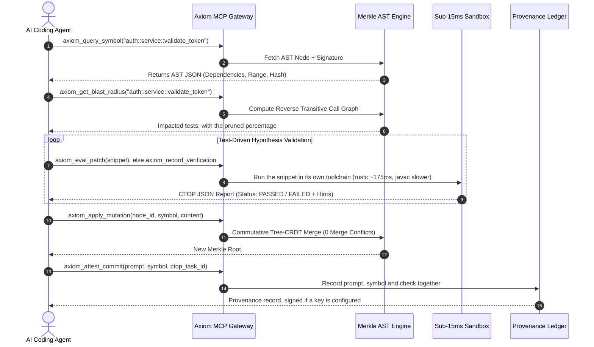

# AXIOM: AI Agent Machine-Readable Usage Guide
<!-- Target Audience: Autonomous AI Coding Agents, LLM Orchestrators, MCP Clients -->

---

## 1. Quickstart: Registering AXIOM MCP Server

To enable an AI agent to use Axiom for zero-clone code navigation and sub-millisecond test sandboxing, register the Axiom server in your agent configuration file:

### Cursor (`~/.cursor/mcp.json`) / Claude Desktop (`claude_desktop_config.json`)
```json
{
  "mcpServers": {
    "axiom": {
      "command": "C:/path/to/axiom/target/release/axiom.exe",
      "args": ["serve"]
    }
  }
}
```

Or run `axiom mcp-config` from the command line to generate this automatically.

---

## 2. Standard Autonomous Agent Development Loop

When developing or refactoring code, follow this 4-step workflow:



---

## 3. MCP Tool Reference

Seven tools. Every response below is what the current build returns; the shapes
were captured from a running server rather than written from memory.

A tool that cannot answer returns an `error` field rather than a plausible
answer. That distinction is the point of most of what follows.

---

### 3.1 `axiom_query_symbol`

Look up one symbol.

* **Request**: `{"symbol_path": "auth::service::validate_token"}`
* **Response**:
  ```json
  {
    "symbol_path": "C:/work/src/lib.rs::validate_token",
    "kind": "function",
    "id": "node_2b4cc05ea97d",
    "hash": "2b4cc05ea97d276538c9650a9ba3942a743b681c46fe6f6980b072c05b2dd23c",
    "signature": "pub fn validate_token(token: &str) -> bool {",
    "docstring": null,
    "source_range": [42, 42],
    "dependencies": []
  }
  ```

`signature` is the declaration as it was read, and `source_range` is a
one-based inclusive line range in the file `symbol_path` names, so
`sed -n '42,42p' C:/work/src/lib.rs` prints it. A wrapped parameter list spans
several lines and the range covers all of them. `[0, 0]` means the parser
recorded no position, which is what a node inserted through
`axiom_apply_mutation` has.

A shorter name resolves when it identifies exactly one symbol: `validate_token`
finds `pkg.Class::validate_token`. A name matching several returns the candidates
instead of picking one, under `error` and `candidates`.

A missing, blank or non-string `symbol_path` is an error, not a lookup for the
empty string.

---

### 3.2 `axiom_get_blast_radius`

The tests that reach a symbol.

* **Request**: `{"symbol_path": "auth::service::validate_token", "max_depth": 1}`
* **Response**:
  ```json
  {
    "symbol": "C:/work/src/lib.rs::validate_token",
    "direct_tests": ["C:/work/src/tests.rs::test_auth_validation"],
    "impacted_tests": ["C:/work/src/tests.rs::test_auth_validation"],
    "tests_by_depth": { "1": ["C:/work/src/tests.rs::test_auth_validation"] },
    "total_tests_in_repo": 2219,
    "pruned_test_percentage": 98.56
  }
  ```

`max_depth` defaults to 1, which is direct dependents. Raising it was measured
and is usually not worth it: at depth 2 one symbol went from 57 impacted tests to
146 with no recall gain, and the overlap between the blast radii of unrelated
symbols rose from 0.00 to 0.19.

**Agent directive**: run the tests in `impacted_tests` rather than the whole
suite. That is direct references plus calls through an accessor returning the
type.

`tests_by_depth` goes further than `impacted_tests` does. Depth 2 and beyond are
tests that reach the symbol through another function or class; they are surveyed
but left out of the answer, because including them costs more precision than it
gains. Read them when a change looks risky and widen `max_depth` to move them in.
The survey runs to depth 3 whatever `max_depth` is, so a symbol that no test
names directly still says where its callers are tested.

An empty `impacted_tests` means the index found no dependents. That is not the
same as nothing being affected: if the change matters, run the suite. It is the
usual answer for a private helper several calls below anything a test names:
check `tests_by_depth` before concluding nothing covers it.

### What the graph is built from

Two mechanisms, and which one applies depends on the language.

Java, Kotlin and Scala symbols are keyed by package, `pkg.Class::method`, and
the edges come from imports, from same-package and fully-qualified references,
and from accessor return-type inference, so a test calling
`ctx.sharedRaceConditionDetector()` still reaches `RaceConditionDetector`.

Rust, Python, TypeScript, JavaScript and Go symbols are keyed by file path,
`src/lib.rs::write_atomically`, and the edges come from call sites and type
mentions in comment-stripped source, attributed to the function they sit in
rather than to the file. Attribution by line is wrong for a nested function; the
error it makes is charging a sibling rather than charging every test in the file.

Measured on this repository, 154 non-test symbols against 49 tests: a mean of
3.1 impacted tests, 93.7% pruned, mean pairwise overlap between the radii of two
symbols 0.07, and no symbol returning the whole suite. On a sample of ten symbols
paired with a test that plainly exercises them, nine were found within the
survey, seven of them at depth 1. The tenth is a private helper five calls below
any test, which is past the survey.

---

### 3.3 `axiom_eval_patch`

Compile and run a snippet.

* **Request**: `{"symbol_path": "auth::service::validate_token", "code_snippet": "assert!(validate_token(\"\"));"}`
* **Response (failure)**:
  ```json
  {
    "task_id": "eval_1f4",
    "engine": "tier1_wasi_cranelift",
    "status": "FAILED",
    "execution_duration_ms": 322.43,
    "passed_checks_count": 0,
    "failed_checks": [{
      "symbol": "validate_token",
      "error_type": "Panic/AssertionFailure",
      "expected": "Invariant expression == true",
      "actual": "thread main panicked at eval_main.rs:8:5: assertion failed",
      "hint": "Assertion expression evaluated to false during sandbox execution"
    }]
  }
  ```

The snippet is written out and run by the toolchain of the language the symbol
was indexed from, so expect a few hundred milliseconds rather than microseconds,
and real compiler errors for code that does not compile. Which toolchain ran it
is in `engine`.

| Language of the symbol | Toolchain | `engine` |
| --- | --- | --- |
| Rust | `rustc`, then the compiled binary | `tier1_wasi_cranelift` |
| WAT or wasm snippet | wasmtime Cranelift | `tier1_wasi_cranelift` |
| Python | `python3`, else `python` | `tier2_native_python` |
| JavaScript | `node` | `tier2_native_node` |
| TypeScript | `deno`, else `tsc` then `node` | `tier2_native_typescript` |
| Go | `go run` | `tier2_native_go` |
| Java | `javac`, then `java -ea` | `tier2_native_java` |
| Kotlin, Scala | none | refused |

Assertions are supplied where the language does not have them built in. A
JavaScript snippet gets `const assert = require('node:assert')` unless it
already asked for it; Java runs with `-ea`, without which every `assert` is a
no-op and a false one would look like a pass. A TypeScript snippet gets nothing,
because deno and tsc-then-node disagree about how a module is reached, so bring
your own check.

**This is not a sandbox for anything but WebAssembly.** Tier 2 invokes the real
compiler or interpreter with the privileges the axiom process holds, exactly as
the `rustc` tier always has. Set `AXIOM_EVAL_NATIVE=off` to refuse tier 2
outright. A command that has not finished after `AXIOM_EVAL_TIMEOUT_SECS`
(default 30) is killed and reported as `TIMEOUT`, so a snippet that never
terminates cannot hold the session open.

Three answers mean nothing ran, and none of them is ever `PASSED`:

* `EVALUATOR_UNAVAILABLE` with `UnsupportedLanguage`: the language has no
  evaluator. Kotlin and Scala are read by the Java parser, which does not make
  `javac` able to run them.
* `EVALUATOR_UNAVAILABLE` naming the programs it looked for: the toolchain is
  not on `PATH`, or `AXIOM_EVAL_NATIVE=off`.
* `EVALUATOR_UNAVAILABLE` with `AmbiguousSymbol` and a `candidates` list: the
  name matches several symbols, so which language to use is unknown. Name one.

In all three, run the project's own tests and report the outcome with
`axiom_record_verification`; `axiom_get_blast_radius` will name the tests.

**Agent directive**: on `FAILED`, read the hint and actual output before changing
the code. Keep the `task_id`, because a provenance record must name it.

---

### 3.4 `axiom_record_verification`

Report a check axiom did not run, so a provenance record can rest on it.

* **Request**: `{"task_id": "mvn_run_01", "passed": true, "command": "mvn test -Dtest=ConcurrencyRunnerTest"}`
* **Response**:
  ```json
  {
    "task_id": "mvn_run_01",
    "passed": true,
    "recorded_as": "reported",
    "note": "Axiom did not run this. The provenance record will say the outcome was reported by the agent, not observed by axiom."
  }
  ```

This exists because the sandbox only compiles Rust. An agent that ran a project's
own suite has checked something real and can say so; what it cannot do is have
that recorded as axiom's own observation.

---

### 3.5 `axiom_apply_mutation`

Apply a Tree-CRDT mutation and persist the symbol.

* **Request**: `{"node_id": "node_auth_val", "symbol_path": "auth::service::validate_token", "content": "pub fn validate_token(t: &str) -> bool { t.len() > 10 }"}`
* **Response**:
  ```json
  {
    "status": "APPLIED",
    "new_merkle_root": "1a9dab4c9c1e3f13a9a206501457b6511de0f552df57039e9952559e81590366",
    "active_ast_nodes": 102,
    "crdt_op": { "Insert": { "node_id": "node_auth_val", "timestamp": { "agent_id": 31728, "time": 2 } } }
  }
  ```

Only the mutated symbol is written, under a lock, so an agent sharing the
workspace does not lose its work to this one.

---

#### Writing a TypeScript snippet

Nothing is injected, and the two recipes do not offer the same environment, so a
snippet has to bring assertions that need neither an import nor an ambient type
declaration:

```ts
const n: number = 1 + 1;
if (n !== 2) { throw new Error(`expected 2, got ${n}`); }
```

`import assert from "node:assert"` is not portable here. It runs under deno and
is a type error under `tsc`, which has no `@types/node` installed, so the same
snippet passes on one machine and comes back as a compilation error on another.
A thrown error exits non-zero under both, which is what the report reads.

---

### 3.6 `axiom_attest_commit`

Record the provenance of a change.

* **Request**: `{"prompt": "Fix the token length invariant", "symbol_path": "auth::service::validate_token", "ctop_task_id": "eval_1f4", "agent_identity": "claude-code"}`
* **Response**:
  ```json
  {
    "symbol_path": "auth::service::validate_token",
    "verified_by": "sandbox",
    "verification_detail": "axiom sandbox, engine tier1_wasi_cranelift",
    "ctop_proof_hash": "eval_1f4",
    "parent_merkle_root": "merkle_root_prev_77a1",
    "commit_merkle_root": "merkle_root_1a9dab4c",
    "previous_seal": "blake3_seal_0147bb",
    "seal": "blake3_seal_26ba03bb89e57ade9e0ca6214daeb22f",
    "signature": "ddcc139ce344",
    "public_key": "2c37bfc05ad1",
    "agent_identity": "claude-code",
    "timestamp": "2026-08-21T01:24:03Z"
  }
  ```

`ctop_task_id` must name a check this server performed or was told about. A task
it has no record of, or one that failed, is refused with an `error` explaining
which of the two paths to take.

`seal` is a BLAKE3 digest over the record, so it shows the record is unaltered
and nothing about who wrote it. `signature` and `public_key` are present when a
signing key was configured through `AXIOM_SIGNING_KEY_FILE`. `previous_seal`
chains the record to the one before it, so removing a record from the ledger is
visible.

`agent_identity` is what you ask to be recorded as. Axiom stores it and does not
check it, so on its own it is a claim: any caller able to reach the server can
send any name. What makes it worth recording is that it is hashed into `seal`
and covered by `signature`, so it cannot be edited after the fact, and on a
signed record it is bound to the key that issued it. Omit the field and the
record reads `unattributed`, which is the honest answer when nobody named
themselves. It must be printable single-line text of at most 128 characters;
`axiom verify` prints it as one line, and a value carrying a newline could add
lines of its own to that output. Anything else is refused rather than trimmed.

`verified_by` is `sandbox` when axiom compiled and ran the code, and `reported`
when an agent ran something else and said so. Do not present the second as the
first: axiom vouches for what it ran and is repeating what it was told.

---

### 3.7 `axiom_search_regex`

Search source text, falling back to symbol names.

* **Request**: `{"query": "new CyclicBarrier", "mode": "literal", "max_results": 20}`
* **Response**:
  ```json
  {
    "query": "new CyclicBarrier",
    "mode_requested": "literal",
    "mode_applied": "literal",
    "matches_count": 20,
    "matches": [{
      "match_kind": "text",
      "file_path": "C:/work/src/test/java/DetectorRegistrationRaceTest.java",
      "line_number": 163,
      "line_content": "CyclicBarrier barrier = new CyclicBarrier(2);"
    }]
  }
  ```

`mode` is `literal` by default, so `.` and `(` match themselves. `regex` compiles
the query as a pattern; `auto` uses regex only for a query containing something
meaningless as literal text. The mode actually applied comes back, so a caller
can check what it got. An invalid pattern is refused rather than retried as a
literal.

`match_kind` is `text` for a hit on a line of source and `symbol` for a hit on a
symbol name. A symbol hit has no line, so `line_number` is `null` rather than a
fabricated 1.

---

## 4. CLI Reference Commands

| Command | Purpose |
|---|---|
| `axiom serve` | Starts the native MCP server over `stdio` (JSON-RPC 2.0) |
| `axiom eval --symbol <SYM> -c <CODE>` | Compiles and runs a Rust snippet, exiting non-zero if it fails |
| `axiom symbol --path <SYM>` | Queries AST node metadata and type signatures |
| `axiom blast-radius --symbol <SYM>` | Calculates impacted tests and pruned percentage |
| `axiom bench --iterations <N>` | Measures how long axiom_eval_patch takes on this machine, reporting min, median, max and mean |
| `axiom demo` | Runs live end-to-end agent workflow demonstration |
| `axiom swarm --agents <N> --ops <M>` | Runs multi-agent Tree-CRDT swarm simulation |
| `axiom verify --symbol <SYM> --prompt <P> [--trusted-key K]` | Looks the provenance record up, checks the chain, and checks the signature against a signer you name |
| `axiom keygen --out <PATH>` | Generates an Ed25519 keypair for signing provenance records. Keep the private key outside any workspace you index |
| `axiom mcp-config` | Outputs ready-to-copy JSON configuration for AI IDEs |
| `axiom scan --path <DIR>` | Scans and indexes a real codebase into the Merkle AST CAS |
| `axiom search --query <STR>` | Ultra-fast Zoekt trigram regex and text search across repo |
| `axiom watch --path <DIR> [--interval-ms N] [--once]` | Re-indexes the tree when it changes, polling a cheap fingerprint between scans |
| `axiom git-export` | Writes .axiom/export.md summarising the index. It does not touch git |
| `axiom dashboard` | Displays live real-time terminal metrics & swarm activity |
